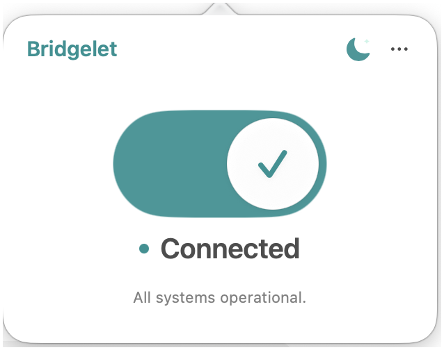
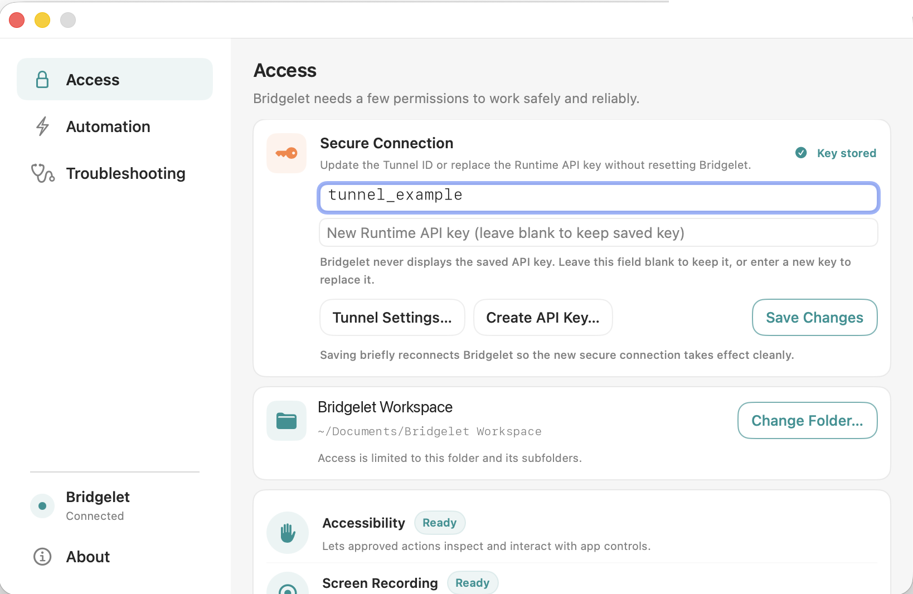
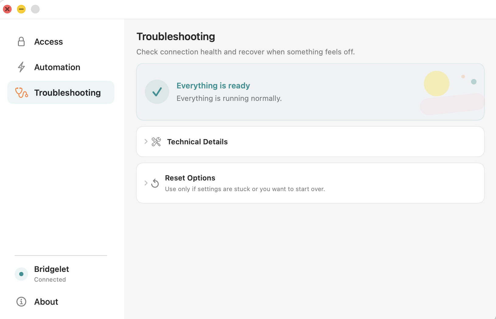

<p align="center">
  
</p>

<h1 align="center">Bridgelet for macOS</h1>

<p align="center">
  <strong>A native menu-bar app that gives ChatGPT secure, scoped access to the local folder you choose.</strong>
</p>

<p align="center">
  
  
  
  
  
</p>

<p align="center">
  <a href="https://github.com/mochingub-kub/bridgelet-releases/releases/tag/v0.7.6-beta.1"><strong>Download Bridgelet 0.7.6 Beta 1</strong></a>
</p>

<p align="center">
  
</p>

## What is Bridgelet?

Bridgelet is a native macOS menu-bar app that connects ChatGPT to one local folder you explicitly choose. It runs a security-bounded Model Context Protocol (MCP) runtime on your Mac, allowing ChatGPT to help with local files and supported workflows without receiving general access to the entire machine.

The app manages the parts that are usually difficult to configure by hand: the secure tunnel connection, the allowed-folder boundary, macOS permissions, operating modes, health checks, and recovery actions. The current public beta exposes 65 MCP tools through a graphical Mac app while keeping sensitive credentials and private runtime details out of normal chat interactions.

Once configured, Bridgelet stays available from the menu bar and reports connection and runtime health. Its main window groups access settings, permissions, and recovery tools.

## What Bridgelet can do

- **Work with local files:** read, search, create, rename, and update files inside the folder you selected.
- **Understand a workspace:** collect bounded context from projects, documents, and related files without repeatedly scanning unrelated locations.
- **Support development work:** inspect source files and Git state and run supported build or test actions for recognized local projects.
- **Use approved macOS capabilities:** inspect or interact with supported app controls only when the required system permissions are granted and Interactive Control is enabled.
- **Stay observable:** report connection health, permission readiness, and diagnostic information without presenting an unrestricted shell to ChatGPT.

<table>
  <tr>
    <td width="50%" align="center">
      <br />
      <strong>Secure, scoped access</strong><br />
      Choose the folder Bridgelet can access, manage tunnel credentials, and review the permissions used by optional features.
    </td>
    <td width="50%" align="center">
      <br />
      <strong>Built-in troubleshooting</strong><br />
      Check connection health and recover from common setup problems without leaving the app.
    </td>
  </tr>
</table>

## How Bridgelet works

```text
ChatGPT → Secure MCP Tunnel → Bridgelet → Selected Folder
```

1. **You choose the boundary.** Bridgelet receives access to one folder and its subfolders. Changing that folder is an explicit action in the app.
2. **Bridgelet starts its local MCP runtime.** The runtime advertises the supported tools and applies Bridgelet's local checks before an action reaches macOS or your files.
3. **The tunnel establishes the connection.** OpenAI's tunnel client uses an outbound secure connection, so the private local MCP runtime does not need to be exposed directly to the public internet.
4. **ChatGPT discovers and calls tools.** Your configured MCP connection can request available actions. Bridgelet evaluates each request against folder scope, operating mode, permissions, and tool-specific safeguards.
5. **Results return through the same path.** ChatGPT receives a bounded tool result rather than unrestricted control of your Mac.

Bridgelet does not replace ChatGPT's confirmation, approval, workspace, or account controls. Review consequential actions and choose an appropriately limited folder.

## Permissions and operating modes

Bridgelet separates basic file access from optional desktop interaction. You do not need to grant every permission merely to install or connect the app.

| Control | What it enables | When to enable it |
| --- | --- | --- |
| Selected folder | Supported file operations inside one folder and its subfolders | Required for local file work |
| Accessibility | Inspection and interaction with supported macOS app controls | Only for approved automation workflows |
| Screen Recording | Reading supported on-screen state when a tool requires it | Only for visual or desktop-aware workflows |
| Silent Mode | Background and non-interactive operations | Recommended normal mode |
| Interactive Control | Foreground interaction with supported apps | Enable deliberately for a task, then disable when finished |

macOS controls Accessibility and Screen Recording consent in **System Settings → Privacy & Security**. Removing a permission disables its dependent features.

## Requirements

| Item | Requirement |
| --- | --- |
| Mac | Apple Silicon (`arm64`) |
| macOS | macOS 27.0 or later |
| Bridgelet release | 0.7.6 Beta 1, Build 77 |
| Connection | Your own Secure MCP Tunnel ID and Runtime API key |
| ChatGPT | A custom MCP connection configured for your tunnel |
| Signing | Ad-hoc with Hardened Runtime |
| Apple notarization | Not notarized |

## Install and first-time setup

1. Download `Bridgelet-0.7.6-build77-macos-arm64-no-cost.zip` from the [release page](https://github.com/mochingub-kub/bridgelet-releases/releases/tag/v0.7.6-beta.1).
2. Verify the ZIP checksum using the instructions below before opening it.
3. Unzip the download and move `Bridgelet.app` to `/Applications`.
4. Open Bridgelet normally. If macOS blocks this non-notarized beta, use **System Settings → Privacy & Security → Open Anyway**. Do not disable Gatekeeper globally.
5. In Bridgelet, enter your Secure MCP Tunnel ID and Runtime API key. The saved API key is not displayed again; leaving the replacement field blank keeps the stored key.
6. Choose the local folder that Bridgelet may access. Use a dedicated workspace when possible instead of a broad personal directory.
7. Grant only the macOS permissions required by the features you intend to use.
8. Configure the corresponding MCP connection in ChatGPT, then confirm that Bridgelet reports **Connected** and healthy.

## Using Bridgelet

After connecting, describe the task and its intended boundary. Representative requests include:

- “Summarize the Markdown documents in this workspace.”
- “Find where this configuration value is defined, but do not modify files.”
- “Review the current Git changes and suggest the smallest relevant test set.”
- “Run the supported project tests and report failures without changing source files.”

Tool availability depends on the build, folder, operating mode, and permissions. If a tool is missing, check connection health before changing credentials or resetting the app.

## Security and privacy boundaries

- File access stays inside the folder you select and its subfolders.
- Bridgelet does not display the saved Runtime API key after it has been stored.
- Silent Mode is the normal default; foreground desktop control is separately gated.
- macOS Accessibility and Screen Recording permissions are used only by features that require them.
- Bridgelet does not expose an unrestricted shell as a general-purpose ChatGPT tool.
- Credentials belong in Bridgelet's setup UI, never in a ChatGPT message, screenshot, log attachment, or GitHub issue.
- A checksum verifies that a downloaded file matches the published bytes. It does not prove Apple notarization or an Apple-verified publisher identity.

Treat MCP tools as meaningful access to the selected workspace. Keep backups or version control for important files, and do not select folders containing unrelated secrets.

## Troubleshooting

| Problem | Check first |
| --- | --- |
| Bridgelet shows Disconnected | Confirm network access, Tunnel ID, Runtime API key, and current tunnel settings |
| ChatGPT cannot discover tools | Confirm Bridgelet is Connected, then reconnect or refresh the MCP connection in ChatGPT |
| A file cannot be read or changed | Confirm the file is inside the selected folder or one of its subfolders |
| Accessibility or Screen Recording is not ready | Re-enable Bridgelet under macOS Privacy & Security, then restart the affected app if required |
| macOS blocks the first launch | Use Privacy & Security → Open Anyway; do not disable Gatekeeper globally |

Start with Bridgelet's **Troubleshooting** screen. Expand **Technical Details** for diagnostics and use reset options last; resetting may require reconnection and renewed permissions.

For reproducible bugs, open a [GitHub Issue](https://github.com/mochingub-kub/bridgelet-releases/issues) with the version/build, macOS version, expected behavior, and actual behavior. Remove credentials, private paths, and file contents before posting.

## Verify the download

Expected SHA-256:

```text
225755f7f103c8a0c6ac2e8dc76eb5b40ceaa2d2a2d151b69d4f845a8524b947
```

From the directory containing the ZIP, run:

```sh
shasum -a 256 Bridgelet-0.7.6-build77-macos-arm64-no-cost.zip
```

The output must match the expected digest exactly. If it does not, delete the ZIP and download it again from the official release page. The release also provides a [checksum file](https://github.com/mochingub-kub/bridgelet-releases/releases/download/v0.7.6-beta.1/Bridgelet-0.7.6-build77-macos-arm64-no-cost.zip.sha256) and a [public validation receipt](https://github.com/mochingub-kub/bridgelet-releases/releases/download/v0.7.6-beta.1/Bridgelet-0.7.6-build77-macos-arm64-no-cost.receipt.txt).

## Beta limitations

- Apple Silicon only.
- macOS 27.0 or later.
- First launch may require **Open Anyway**.
- Fresh-user and separate-physical-Mac acceptance are still pending.
- Automatic updates are not enabled for this beta.
- This build is a pre-release and should not be treated as production-stable software.

## Further reading

Official OpenAI documentation and resources:

- [Secure MCP Tunnel](https://developers.openai.com/api/docs/guides/secure-mcp-tunnels)
- [MCP and Connectors](https://developers.openai.com/api/docs/guides/tools-connectors-mcp)
- [Connect and test your plugin](https://developers.openai.com/plugins/deploy/connect-chatgpt)
- [Model Context Protocol for ChatGPT and Codex](https://learn.chatgpt.com/docs/extend/mcp)
- [OpenAI Platform tunnel settings](https://platform.openai.com/settings/organization/tunnels)
- [OpenAI Platform API keys](https://platform.openai.com/api-keys)
- [OpenAI tunnel-client releases](https://github.com/openai/tunnel-client/releases)

Bridgelet is an independent application. These links document the OpenAI platform components and configuration concepts Bridgelet works with; they do not indicate OpenAI authorship or endorsement of Bridgelet.

## About this repository

This is a binary-only release repository. Bridgelet application source code and private development history are not published here. GitHub's automatic source archives contain only this repository's public files; they do not contain the private Bridgelet application source.

No open-source license is currently published in this repository. Do not assume that Bridgelet is distributed under the MIT License or another open-source license unless a license file is added explicitly.
